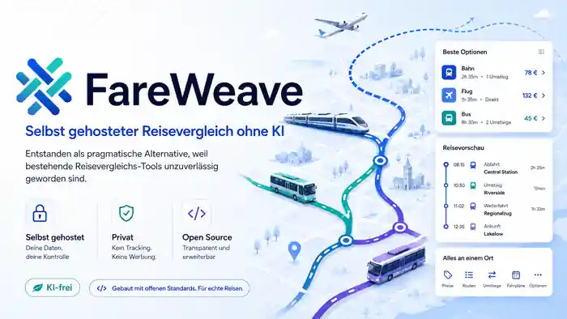

# FareWeave



[Start](README.md) | [Deutsch](README.de.md) | [English](README.en.md)

**FareWeave is a self-hosted travel comparison service without AI, focused on journeys originating in Germany.**

Rail, the Deutschlandticket, split tickets, FlixTrain, FlixBus, flights, airport feeders, transfers, and accommodation are combined into a single itinerary. FareWeave does not merely look for a low price somewhere. Every part of the journey must fit together both chronologically and logically.

Current version: **0.0.1**

FareWeave does not sell or book anything itself. If a provider supplies a usable offer link, it can be opened directly from the result. Where no direct link is available, FareWeave offers a suitable manual cross-check, for example with Deutsche Bahn, Google Flights, Google Hotels, or Google Maps. Price and availability must always be verified with the actual provider.

## Why FareWeave?

The project began with a simple request: I wanted to search for rail connections quickly again and, when needed, **have split ticketing checked as part of the same search**.

[BetterBahn](https://github.com/BetterBahn/betterbahn) was an interesting solution for a long time, and I still like its basic idea. In my recent searches, however, it worked increasingly poorly. Especially with split ticketing, even the best idea is of little use if the connection or price does not arrive reliably.

At some point, I stopped waiting for it to work the way I needed again.

**Thanks to BetterBahn for the motivation to build it again independently.**

FareWeave uses no BetterBahn code and is not a fork. Its rail logic, split ticketing, and journey comparison were built anew for FareWeave.

The project did not stop at improving split-ticket searches. For journeys from Germany, I did not want to search DB first, then open BetterBahn, check FlixTrain and FlixBus afterward, and finally assemble flights, feeders, and accommodation separately for a longer trip. One request should handle as much of that as possible in a single run.

The original split-ticket problem therefore grew into a much broader travel comparison service.

## Built for journeys from Germany

FareWeave deliberately focuses on journeys that begin in Germany or include a substantial part of their itinerary here. Deutsche Bahn, the Deutschlandticket, German airports, FlixTrain, and FlixBus are therefore core parts of the system rather than later additions.

A journey may, for example, begin with a Deutschlandticket or DB ticket to the airport, continue with a flight, and finish with a transfer and accommodation at the destination. FareWeave treats these parts as one connected journey.

The feeder must arrive before the flight. A configured airport buffer must actually exist. A search starting at 06:00 must not recommend a midnight connection. If BER is requested, Frankfurt or Cologne/Bonn must not appear merely because those airports also have a Terminal 1 or 2.

That sounds obvious. Once several data sources are combined, it no longer is.

This is precisely why **no AI decides** which connection is supposedly sensible in FareWeave.

## Split ticketing is built in

Split ticketing is part of the normal search. It is not a second tool into which a previously found connection has to be copied.

When enabled, FareWeave checks whether several separate rail tickets could make a connection cheaper than a through DB ticket. The direct fare and split fare remain separate. A low split fare is never presented as the price of a normal DB ticket.

For this use case, the additional BetterBahn step is no longer necessary.

FareWeave distinguishes, among other things, between a real DB direct fare, a split-ticket fare, local transport association fares, paid journey sections, and a connection fully covered by the Deutschlandticket. Unknown prices or prices that cannot be assigned reliably remain unknown instead of being estimated.

## Deutschlandticket included in planning

A request can specify whether a Deutschlandticket is available. FareWeave accounts for it directly during planning.

A local or regional connection fully covered by the D-Ticket is treated as having **EUR 0 in additional ticket costs**. A local association fare returned by a provider is not displayed as if it still had to be paid despite an existing Deutschlandticket.

Paid alternatives remain visible. An ICE or another paid connection can be substantially faster or provide a much better connection to a flight.

There is also a dedicated **D-Ticket-only mode**. It only considers ground connections that can be used entirely with the Deutschlandticket, without ICE, IC, Flix, or any additional ticket. Multiple ordinary transfers remain possible.

## Rail requests

The complete DB logic runs independently of trvl.

FareWeave uses, among other components, [db-vendo-client](https://github.com/public-transport/db-vendo-client), its own DB and DBnav processing, and `curl_cffi`. The latter helps with HTTP requests where basic clients quickly fail because of bot protection or other countermeasures.

Results are not accepted blindly. FareWeave validates time windows, fare semantics, stops, transfers, and—for complete journeys—the subsequent chronology.

A provider may fail or time out without automatically taking down the entire search.

## FlixTrain and FlixBus

FlixTrain and FlixBus can be included directly in the same comparison. A DB connection is therefore compared not only with another DB ticket but also with alternative long-distance services.

FareWeave can also use Flix in mixed journey chains. One example is a local section covered by the Deutschlandticket, followed by a paid Flix section and another D-Ticket section.

Additional costs are assigned only where another ticket is actually required.

## Why trvl is included

While looking for usable data sources, I found [trvl](https://github.com/MikkoParkkola/trvl).

trvl is not a finished travel comparison website. It is a local tool and extensive provider layer intended primarily for AI assistants and MCP clients. Those providers were precisely what made it interesting for FareWeave.

FareWeave therefore uses trvl as a **partial foundation**, especially for selected flight and accommodation data. It is not a trvl frontend.

The web interface, DB logic, split ticketing, Deutschlandticket evaluation, fare validation, time windows, airport validation, and assembly of the actual itinerary are FareWeave implementations.

trvl supplies data in selected places. FareWeave then applies deterministic rules to decide which results actually fit together.

## Flights

Flight providers are queried separately and have their own time limits. A slow or broken provider must not block the entire journey plan.

FareWeave 0.0.1 first queries **Skiplagged, Ryanair, Vueling, and easyJet**. If those results are insufficient, it continues with **Transavia, Norwegian, Air France/KLM, and Wizz Air**.

The aggregated trvl request is not passed through without limits. FareWeave queries the required providers in isolation, combines usable results, and rejects chronologically implausible flights.

Google Flights is also included as a manual cross-check. In FareWeave 0.0.1 it is **not a separate automated Google Flights provider**, but a suitable search link for the requested route and travel dates.

## Transfers and public transport

A flight journey does not end at the airport. Feeders and transfers are therefore part of the itinerary.

[Transitous](https://github.com/public-transport/transitous) is an additional source for public transport and certain transfers. Depending on the route, DB or Flix connections may also be included.

If no automatically usable transfer is available, FareWeave can provide a manual Google Maps link instead of inventing a connection.

## Accommodation

FareWeave can search for accommodation matching the journey. Check-in and check-out are derived from the calculated travel dates and requested stay duration.

The general accommodation search uses trvl. Depending on its sources, the hotel and room data may contain offers or providers such as **Booking.com, Expedia, Hotels.com, Agoda, Trip.com, Kayak, Trivago**, or direct hotel offers. FareWeave deliberately does not claim to query every one of these providers directly. It processes what the trvl hotel search actually returns.

**Booking.com is technically supported by the underlying hotel search, but is currently not a reliable source in practice.** Its WAF and bot protection may block automated requests. Such a failure is treated as a provider issue and must not terminate the entire accommodation search or journey plan.

Stay22 is also integrated separately into FareWeave. It currently supplies **Expedia and Hotels.com** as additional accommodation sources. An optional `STAY22_API_KEY` may be configured.

Hotels, hostels, apartments, and resorts are distinct accommodation types. A normal hotel search starts at three stars by default. A hostel is not treated as a hotel merely because it has a star rating.

Prices are not guessed either. A total is shown only when it has been verified to cover the complete stay. Nightly prices or ambiguous headline prices remain labelled accordingly.

Google Hotels is additionally available as a manual cross-check.

## FareWeave plans, the provider books

FareWeave is **not a booking platform**.

It does not buy tickets, reserve hotel rooms, or process payment information. FareWeave searches, compares, and assembles a complete journey plan.

When a provider supplies a concrete offer link, the interface displays **“Check/book offer”**. If only a useful search link is available, it displays **“Open more offers”**.

Depending on the journey component, this may lead to Deutsche Bahn, the relevant travel provider, or a manual cross-check with Google Flights, Google Hotels, or Google Maps.

The actual booking always takes place with the provider. Externally supplied prices may change before the booking page is opened. FareWeave therefore does not guarantee a final price and never performs bookings itself.

## Why without AI?

trvl was built to provide real travel data to AI assistants. That is useful for its intended purpose, but I did not want to rely on an AI for the actual decision about an itinerary.

If a departure is at 06:07, it is at 06:07. If a two-hour airport buffer is requested, two hours must be available. If a split ticket costs EUR 27.80, that price must not suddenly be assigned to the through DB ticket. If the Deutschlandticket fully covers a connection, its additional ticket cost must not suddenly become a single fare returned by a transport association.

These are not questions a language model should interpret.

**No AI decides which connection is supposedly sensible.**

FareWeave processes these rules deterministically.

## Developed for Tarnkappe.info

FareWeave was originally developed for [Tarnkappe.info](https://tarnkappe.info/).

It did not begin as a demo or theoretical journey planner. I needed a solution for assembling real journeys more quickly, including DB fares, split ticketing, and the alternatives alongside them.

That internal tool gradually became the public FareWeave project. Once it is built and works, it may as well be useful to others.

## Vibe coding, but not blindly

FareWeave operates **without AI in production and in actual journey decisions**. That does not mean no AI tools were used during development.

Given the number of provider interfaces, response formats, fare rules, logs, edge cases, and regression tests, AI-assisted development tools—and some of what is now commonly called vibe coding—were also used.

A project like this cannot be built by simply entering one instruction and receiving a finished journey comparison service.

Anyone who does not understand the code will not notice when a Cologne/Bonn connection is suddenly accepted as BER, a local association fare becomes a normal DB fare, a split fare is assigned to the wrong ticket, or an overnight connection bypasses a hard departure limit.

The person behind the project must understand, reproduce, and verify precisely these kinds of errors.

FareWeave therefore follows a simple workflow:

```text
Reproduce the error
→ regression test must fail
→ fix the cause
→ the same test must pass
→ complete test suite
→ real live test
```

A fix is not finished merely because the code looks plausible.

Vibe coding was a tool used to build FareWeave. **It is not the logic FareWeave runs on.**

## Technical overview

```text
Browser UI -> FastAPI -> FareWeave orchestration
                         |-> DB backend (db-vendo-client, DBnav, curl_cffi)
                         |-> split-ticket and D-Ticket logic
                         |-> Transitous
                         |-> FlixTrain / FlixBus
                         |-> isolated trvl flight providers
                         |-> trvl hotels + Stay22
                         `-> SQLite cache
```

Providers have separate hard time limits. A timeout is treated as a provider failure and does not automatically block the other journey components.

## Historical reliability of rail connections

FareWeave can additively enrich rail legs with 90 days of historical observations from
[`piebro/deutsche-bahn-data`](https://huggingface.co/datasets/piebro/deutsche-bahn-data).
The normal search, prices, and ranking remain independent of this enrichment.

The idea for historical reliability scoring was inspired in part by **Delay**. In our
tests, its approach proved unreliable because requests repeatedly failed. FareWeave
therefore implements the feature independently, including a local cache and a working
fallback path.

The required historical train data is filtered directly from
`piebro/deutsche-bahn-data` and stored locally. Train/month data that is already cached
does not have to be fetched again for subsequent searches. Historical enrichment is
isolated from the actual journey search. If Hugging Face is slow, unavailable, or the
history request times out, the journey itself remains available. FareWeave then cleanly
falls back to displaying the connection without a reliability value instead of failing
the entire search with a 502 error.

For a direct journey, the percentage is the empirically observed share of concrete run
instances that **were not explicitly cancelled and reached their destination no more
than ten minutes late**. Missing observations are never treated as cancellations.

For a transfer, the value is the empirical share of observed runs of the incoming train
whose arrival delay was no greater than the scheduled transfer time; explicit
cancellations count as missed connections. For multiple transfers, the overall value is
calculated as a clearly identified independence estimate based on the individual
probabilities. Individual values and sample sizes remain visible in the details.

The evaluation prioritises the train number, train type, concrete route segment, weekday,
and four-hour time window. If a subset is too small, it falls back within the same
concrete train/route history to weekday, time window, and finally all observations. No
value is invented without a reliable train number and EVA IDs.

DuckDB is used exclusively as an embedded in-memory Parquet engine. Only filtered
train/month Parquet files are persisted under `/var/lib/reisevergleich/history`;
metadata and completed statistics remain in the existing `cache.sqlite3`. FareWeave
creates neither a second database nor a full dataset mirror. Setting
`HISTORY_ENABLED=false` disables the layer completely.

## Running locally

Docker and the Docker Compose plugin are required. On first launch, the installer creates
a `.env` containing a random internal bridge token, builds both images, and runs the
container regressions and DB self-tests.

```bash
chmod +x install.sh
./install.sh
```

By default, the interface is available locally only at <http://127.0.0.1:8791>. The
health endpoint is <http://127.0.0.1:8791/api/health>.

To deliberately expose FareWeave on a LAN, set the following in `.env`:

```env
FAREWEAVE_BIND_HOST=0.0.0.0
```

### Manual installation

```bash
cp .env.example .env
sed -i "s/CHANGE_ME/$(openssl rand -hex 32)/" .env
docker compose build
bash scripts/container-check.sh
docker compose run --rm --no-deps -e REISEVERGLEICH_SELF_TEST=1 db-api
docker compose up -d
```

An optional Stay22 key may be provided as `STAY22_API_KEY` in `.env`. Without a key,
a provider failure or rate limit remains isolated.

### Updating trvl

trvl is pinned through exactly one build argument. FareWeave 0.0.1 uses
`trvl v1.21.3` by default.

For a later published version tag, rebuild it as follows:

```bash
TRVL_REF=v1.21.4 docker compose build app
docker compose up -d app
```

The build derives the internal version number from the tag and checks the hotel, flight,
and ground CLI contracts used by FareWeave. An incompatible trvl release must not be
adopted silently.

## Quality assurance

```bash
bash scripts/check.sh
bash scripts/container-check.sh
```

The checks cover, among other things, Python, Node, and shell syntax; API and UI
contracts; hard time windows; airport identity; fare semantics; the Deutschlandticket;
split tickets; provider isolation; transfers; hotels; and flight chronology.

Live tests require reachable external providers and run separately from reproducible
regression tests.

## Roadmap

### Coming soon: native providers instead of trvl

The next major step is already planned: **trvl will gradually be removed from FareWeave entirely.**

Flight, accommodation, and other providers that are still connected through trvl today are planned to be queried directly by FareWeave. The existing FareWeave logic for provider isolation, timeouts, fallbacks, plausibility checks, price comparison, and caching will remain and connect directly to native provider modules.

An important building block for this is `curl_cffi`, which FareWeave already uses for difficult HTTP requests. It can reproduce browser TLS and HTTP fingerprints much more closely than conventional Python HTTP clients, giving FareWeave additional options for stable direct requests and provider-specific fallback paths where appropriate.

The goal is a FareWeave stack without an external trvl binary:

* native FareWeave flight providers
* native FareWeave providers for accommodation and additional travel components
* FareWeave-owned normalization and error handling
* FareWeave-owned caching and fallback strategies
* no remaining trvl build dependency

The goal is not to bypass protection mechanisms at any cost. If a provider does not expose an interface that can be used reliably, FareWeave should continue to report that transparently while allowing other providers to keep working.

**Coming soon.**

## Known limitations

FareWeave can only be as current as its external providers. Providers may change
interfaces, block requests, alter prices, or temporarily return no usable results.

Booking.com is currently an especially visible example because of its WAF and bot
protection.

FareWeave attempts to make such failures visible while allowing other providers to
continue. It does not invent missing prices or connections as substitutes.

The application is a journey planner and price comparison service, not a booking engine.
Always verify prices, fare conditions, and availability with the actual provider before
purchasing.

## Projects used

FareWeave would not be possible in this form without existing open-source projects and
external services.

- [BetterBahn/betterbahn](https://github.com/BetterBahn/betterbahn) – original motivation
  for integrated split ticketing; FareWeave uses no BetterBahn code.
- [MikkoParkkola/trvl](https://github.com/MikkoParkkola/trvl) – partial foundation for
  selected flight, hotel, and other provider functionality.
- [public-transport/db-vendo-client](https://github.com/public-transport/db-vendo-client)
  – technical foundation of the DB backend.
- [public-transport/transitous](https://github.com/public-transport/transitous) – public
  transport routing data and transfers.
- [Stay22](https://www.stay22.com/) – additional accommodation search, currently limited
  to Expedia and Hotels.com in FareWeave.

Additional dependencies and their applicable licence terms are documented in
[THIRD_PARTY.md](THIRD_PARTY.md).

FareWeave is independent of Deutsche Bahn, BetterBahn, Flix, trvl, Transitous, Stay22,
and all other queried or linked travel providers. Their respective owners retain all
trademarks and names.

## Licence

FareWeave code originating from this repository is available under the
[MIT License](LICENSE).

Third parties retain their own licences. Of particular importance is `trvl v1.21.3`,
which is licensed under the **PolyForm Noncommercial License 1.0.0**. FareWeave's MIT
licence does not override trvl's non-commercial restriction. Anyone wishing to use the
complete default stack commercially must review trvl's licence terms separately.

See [THIRD_PARTY.md](THIRD_PARTY.md) for details.

## Support Tarnkappe

FareWeave was created for Tarnkappe.info and is made publicly available.

If you find FareWeave useful and would like to support the work behind it, the current
options are available on the official donation page:

**[Support Tarnkappe.info](https://tarnkappe.info/spenden/)**

Wallet addresses are deliberately not duplicated in this README. If they change, no old
address should remain in the repository.

If FareWeave saves time on a journey or finds a few euros that would otherwise have been
left in the ticket price, you are of course welcome to send some of that Tarnkappe's way.
